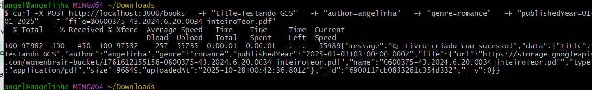
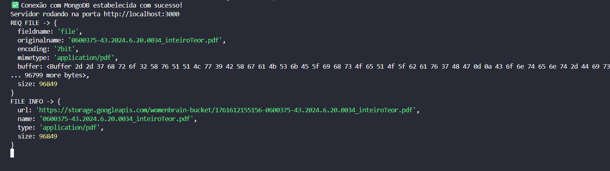

# WomenBrain

## Contexto

Esse projeto surgiu da necessidade que temos de encontrar centralizado livros e artigos de mulheres negras, seja na área de tecnologia ou em outras áreas do conhecimento. A ideia é que possamos contribuir com a construção de um banco de dados colaborativo, onde qualquer pessoa possa adicionar livros e artigos escritos por mulheres negras.

## Instalação

1. Clone este repositório
2. Execute `npm install` para instalar as dependências

## Como contribuir

1. Abra uma issue para discutir a funcionalidade ou correção de bug que você deseja implementar.
2. Faça um fork do repositório e crie uma branch para sua feature (`git checkout -b minha-nova-feature`).
3. Faça suas alterações e commit (`git commit -am 'Adiciona nova feature').
4. Envie para o repositório remoto (`git push origin minha-nova-feature`).
5. Abra um Pull Request.

## Uso

Para iniciar o servidor, execute:

```
npm start
```

ou 

```
npm run dev
```

## Decisões Técnicas

Utilizei Nodejs e Express para construir a API, e MongoDB como banco de dados para armazenar as informações dos livros. A escolha dessas tecnologias se deu pela facilidade de uso, escalabilidade e pela vasta comunidade de suporte.
O deploy foi realizado na GCP (Google Cloud Platform), utilizando o Google App Engine para hospedar a aplicação e o Google Cloud Storage para armazenar os arquivos enviados. Essa escolha foi feita devido à confiabilidade e escalabilidade oferecidas pela GCP, além da integração facilitada entre os serviços.

## Documentação da API

A API possui os seguintes endpoints:

- `GET /books`: Retorna uma lista com todos os livros.
- `POST /books`: Adiciona um novo livro.
- `PATCH /books/:id`: Atualiza os detalhes de um livro existente pelo ID
- `DELETE /books/:id`: Remove um livro pelo ID.

### Criando um livro (POST /books)

```json
{
  "title": "Título do Livro",
  "author": "Autor do Livro",
  "genre": "Gênero do Livro",
  "publishedYear": "2023-01-01"
}
```


### Criando um livro (POST /books) com upload de arquivo no GCS

```json
{
  "title": "Título do Livro",
  "author": "Autor do Livro",
  "genre": "Gênero do Livro",
  "publishedYear": "2023-01-01",
  "file": "URL do arquivo no GCS"
}
```

Testando a rota com cURL e upload de arquivo:


Mensagem de Sucesso da operação + detalhes do objeto salvo no banco:


Detalhes do objeto salvo no banco:


### Listando livros (GET /books)


### Atualizando um livro (PATCH /books/:id)

Antes da atualização: 


```json
{
  "genre": "Fala, Ficção"
}
```

Depois da atualização:


```json
{
  "genre": "Fala | Ficção"
}
```

### Deletando um livro (DELETE /books/:id)

Ao deletar um livro, você verá a seguinte tela:

```json
{
  "response": "204 No Content"
}
```


## Upload de arquivos e regras de dominio público

O Brasil é um país que segue as diretrizes da Lei de Direitos Autorais (Lei nº 9.610/1998). De acordo com essa lei, obras literárias, artísticas e científicas são protegidas por direitos autorais, o que significa que o autor tem o direito exclusivo de utilizar, reproduzir e distribuir sua obra.
70 anos após a morte do autor, a obra entra em domínio público, o que significa que qualquer pessoa pode utilizá-la livremente, sem a necessidade de autorização ou pagamento de direitos autorais. Portanto, ao fazer upload de livros ou artigos para este projeto, certifique-se de que eles estejam em domínio público ou que você tenha permissão do autor para compartilhá-los.

## Author

Desenvolvido por Ângela Carvalho com amor 💜

## License

Projeto open-source. Sinta-se à vontade para contribuir!
