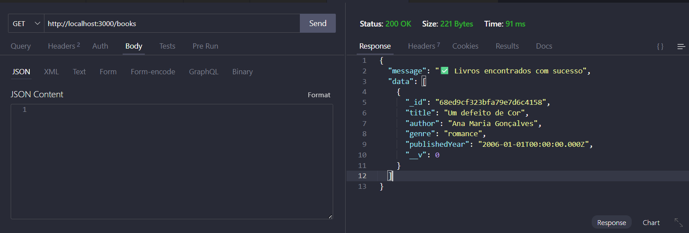
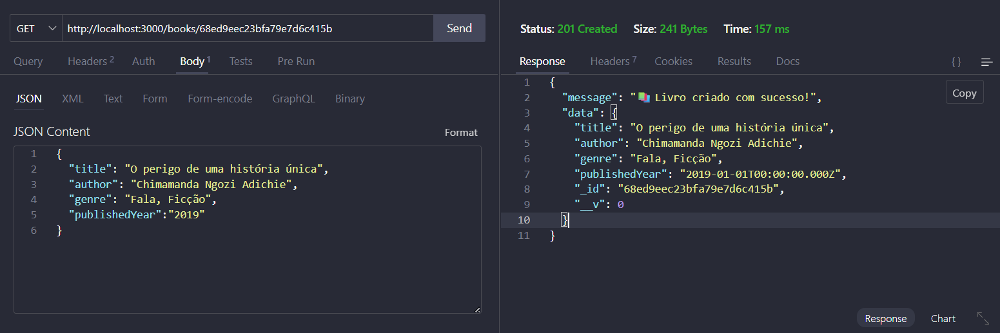
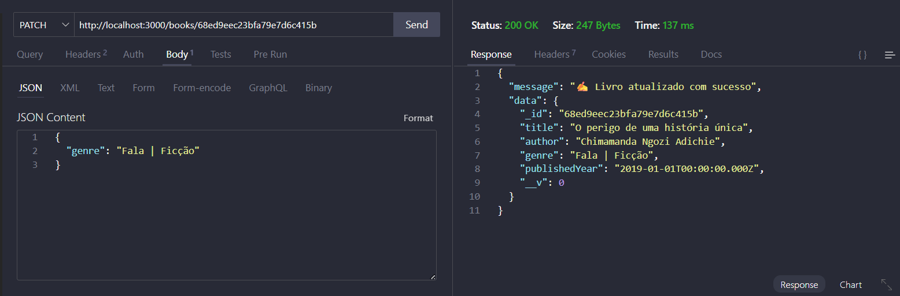
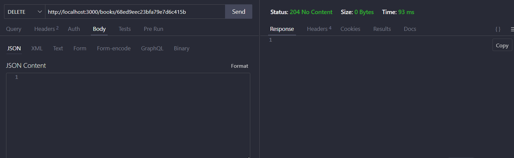

# WomenBrain

## Context

This is the backend part of the WomenBrain project.

## Installation

1. Clone the repository
2. Run `npm install` to install the dependencies

## Usage

To start the server, run:

```
npm start
```

## Documentação da API

A API possui os seguintes endpoints:

- `GET /books`: Retorna uma lista com todos os livros.
- `POST /books`: Adiciona um novo livro.
- `PATCH /books/:id`: Atualiza os detalhes de um livro existente pelo ID
- `DELETE /books/:id`: Remove um livro pelo ID.

### Criando um livro (POST /books)

```json
{
  "title": "Título do Livro",
  "author": "Autor do Livro",
  "genre": "Gênero do Livro",
  "publishedYear": "2023-01-01"
}
```


### Listando livros (GET /books)




### Atualizando um livro (PATCH /books/:id)

Antes da atualização: 


```json
{
  "genre": "Fala, Ficção"
}
```

Depois da atualização:


```json
{
  "genre": "Fala | Ficção"
}
```

### Deletando um livro (DELETE /books/:id)

Ao deletar um livro, você verá a seguinte tela:

```json
{
  "response": "204 No Content"
}
```



## Author

Desenvolvido por Ângela Carvalho

## License

Projeto open-source. Sinta-se à vontade para contribuir!
