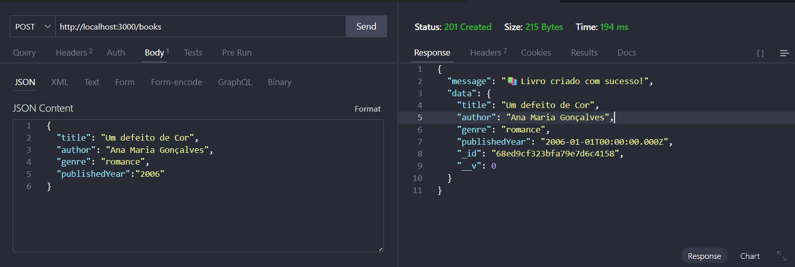
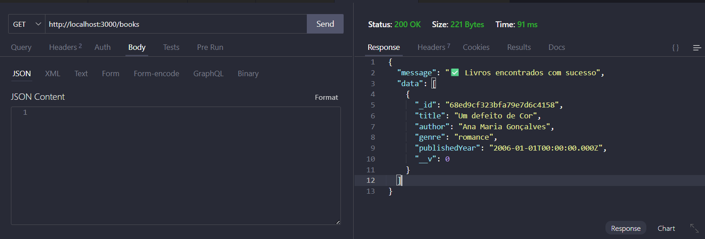
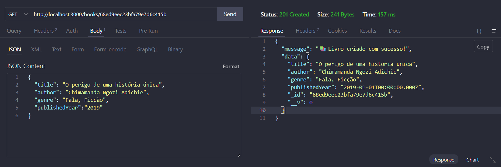
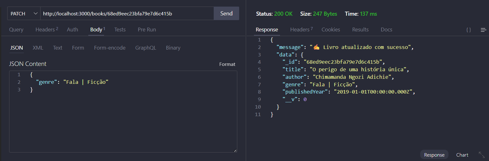
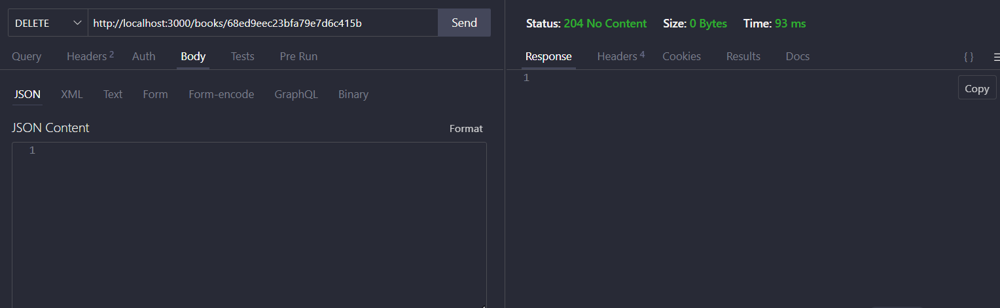

# WomenBrain

## Contexto

Esse projeto surgiu da necessidade que temos de encontrar centralizado livros e artigos de mulheres negras, seja na área de tecnologia ou em outras áreas do conhecimento. A ideia é que possamos contribuir com a construção de um banco de dados colaborativo, onde qualquer pessoa possa adicionar livros e artigos escritos por mulheres negras.

## Instalação

1. Clone este repositório
2. Execute `npm install` para instalar as dependências

## Uso

Para iniciar o servidor, execute:

```
npm start
```

ou 

```
npm run dev
```

## Decisões Técnicas

Utilizei Nodejs e Express para construir a API, e MongoDB como banco de dados para armazenar as informações dos livros. A escolha dessas tecnologias se deu pela facilidade de uso, escalabilidade e pela vasta comunidade de suporte.

## Documentação da API

A API possui os seguintes endpoints:

- `GET /books`: Retorna uma lista com todos os livros.
- `POST /books`: Adiciona um novo livro.
- `PATCH /books/:id`: Atualiza os detalhes de um livro existente pelo ID
- `DELETE /books/:id`: Remove um livro pelo ID.

### Criando um livro (POST /books)

```json
{
  "title": "Título do Livro",
  "author": "Autor do Livro",
  "genre": "Gênero do Livro",
  "publishedYear": "2023-01-01"
}
```



### Listando livros (GET /books)




### Atualizando um livro (PATCH /books/:id)

Antes da atualização: 


```json
{
  "genre": "Fala, Ficção"
}
```

Depois da atualização:


```json
{
  "genre": "Fala | Ficção"
}
```

### Deletando um livro (DELETE /books/:id)

Ao deletar um livro, você verá a seguinte tela:

```json
{
  "response": "204 No Content"
}
```



## Author

Desenvolvido por Ângela Carvalho

## License

Projeto open-source. Sinta-se à vontade para contribuir!
